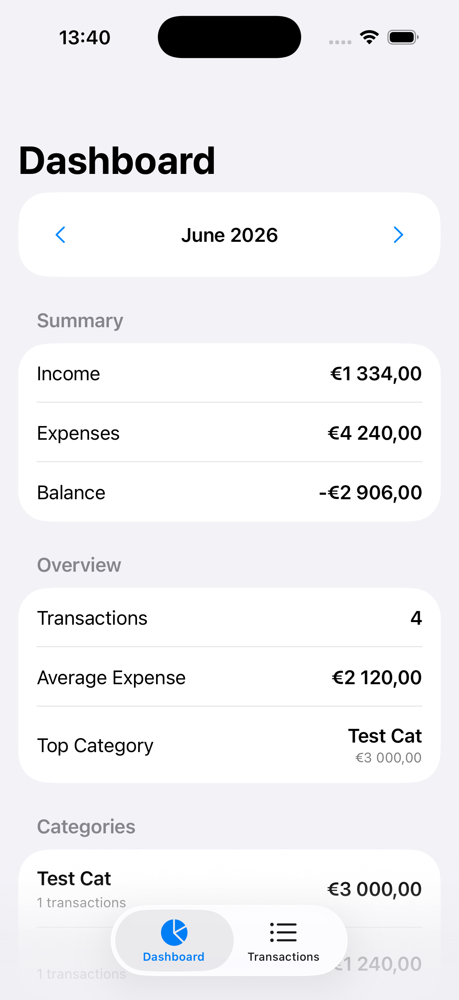
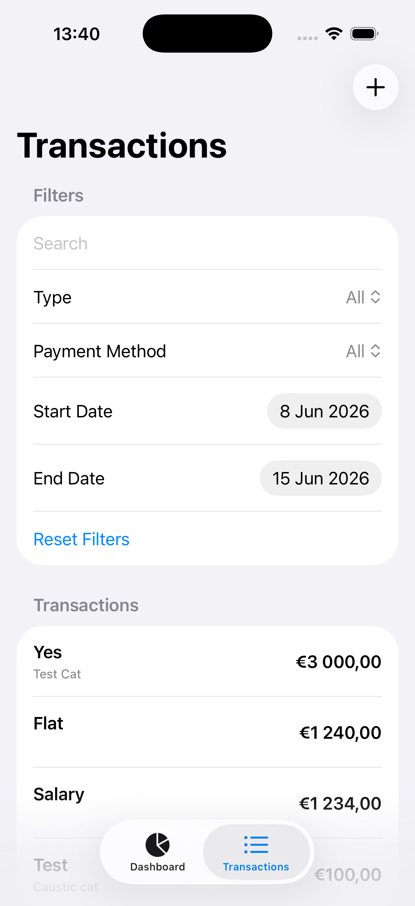
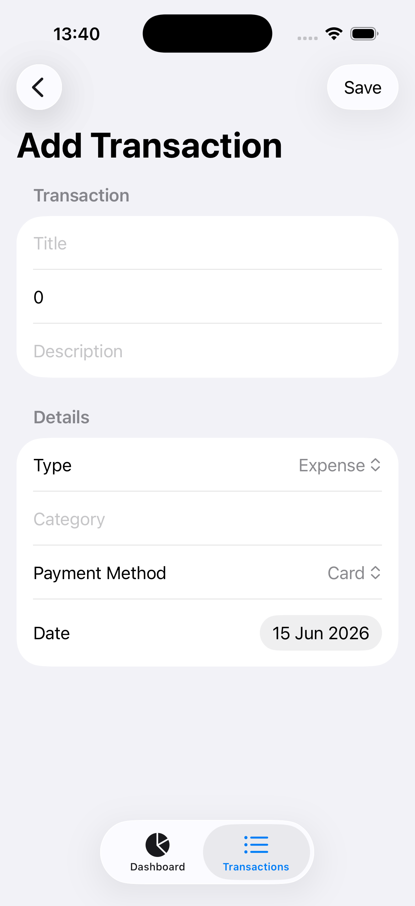
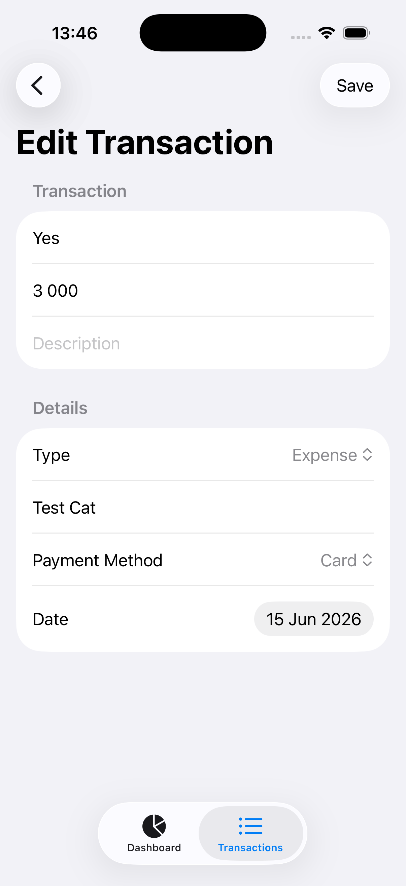

# FinAvsi

<div align="center">


Modern personal finance tracker built with **SwiftUI**, **SwiftData**, and **Clean Architecture**.

</div>

---

## Screenshots

| Dashboard | Transactions |
|-----------|-------------|
|  |  |

| Add Transaction | Edit Transaction |
|-----------|-------------|
|  |  |

---

## Features

### Transaction Management

- Create transactions
- Edit transactions
- Delete transactions
- Income and expense tracking
- Transaction search
- Advanced filtering
- Swipe actions for quick operations

### Dashboard & Analytics

- Monthly financial summary
- Income overview
- Expense overview
- Current balance
- Category breakdown
- Top spending categories
- Monthly aggregation

### User Experience

- Native SwiftUI interface
- NavigationStack navigation
- Reusable UI components
- Fast local persistence
- Smooth animations and transitions

---

## Tech Stack

### UI Layer

- SwiftUI
- NavigationStack
- MVVM

### Data Layer

- SwiftData
- Repository Pattern
- ModelContainer
- ModelContext

### Architecture

- Clean Architecture
- Dependency Injection
- Protocol-Oriented Design

### Quality

- Swift Testing
- XCTest
- GitHub Actions

---

## Architecture

The project follows **Clean Architecture** principles with clear separation between Presentation, Domain, and Data layers.

### Presentation Layer

Responsible for UI rendering and user interaction.

- Views
- ViewModels
- Router
- Reusable Components

### Domain Layer

Contains business rules and application logic.

- Models
- Use Cases
- Protocols
- Analytics Builders

### Data Layer

Responsible for persistence and data access.

- Repositories
- SwiftData Entities
- Mappers
- Local Storage

---

## Dependency Injection

Dependencies are assembled through a centralized `AppContainer`.

Benefits:

- Improved testability
- Loose coupling
- Better maintainability
- Easier mocking and replacement

---

## Project Structure

```text
FinAvsi
├── App
│   ├── AppContainer
│   ├── AppRouter
│   └── RootView
│
├── Features
│   ├── Dashboard
│   ├── Transactions
│   ├── AddTransaction
│   └── EditTransaction
│
├── Domain
│   ├── Models
│   └── UseCases
│
├── Data
│   ├── Repositories
│   ├── Mapper
│   └── Local
│
├── Core
│   ├── DesignSystems
│   ├── Protocols
│   └── Extensions
│
├── FinAvsiTests
└── FinAvsiUITests
```

---

## Testing

### Unit Tests

Coverage includes:

- Repository Tests
- Use Case Tests
- Analytics Builders
- Transaction Filtering

Tests use an in-memory SwiftData container for deterministic execution.

### UI Tests

Coverage includes:

- Application Launch
- Create Transaction
- Edit Transaction
- Delete Transaction
- Search Transaction

UI tests run against an isolated in-memory database.

---

## Continuous Integration

GitHub Actions automatically performs:

- Build Validation
- Unit Test Execution
- Artifact Upload

UI Tests are available through a dedicated workflow to keep CI pipelines fast and reliable.

---

## Requirements

- Xcode 16+
- iOS 17.6+
- Swift 5.10+

---

## Author

**Arsenii Dorogin**

Built with SwiftUI, SwiftData, and Clean Architecture principles.
